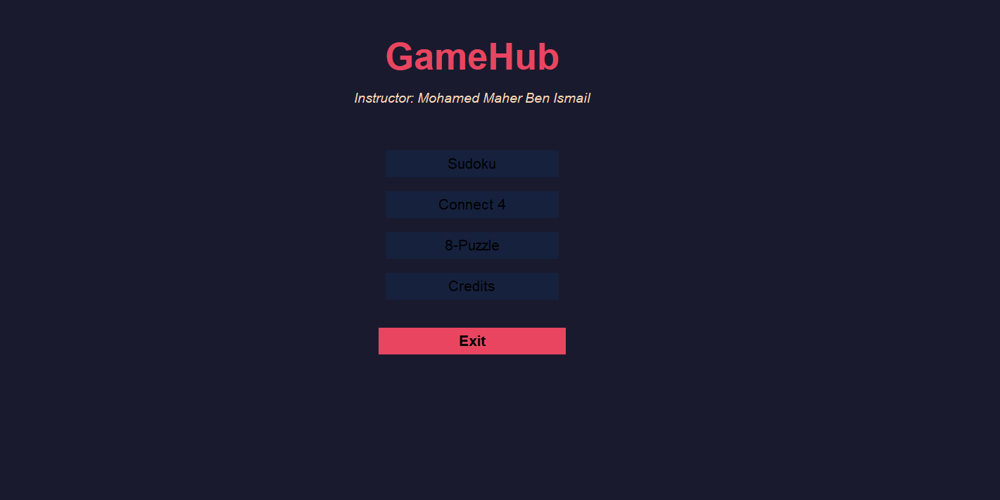
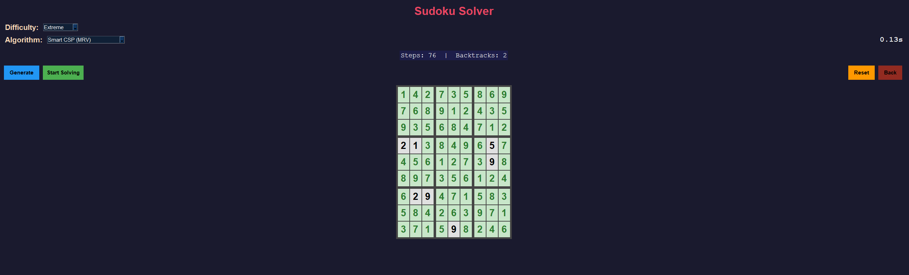
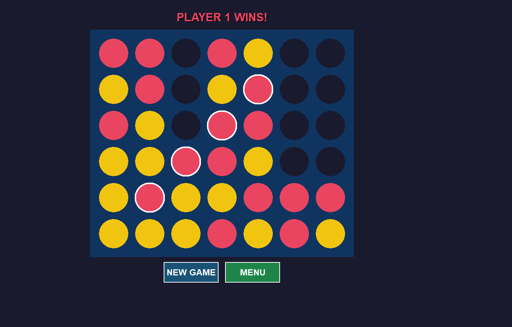
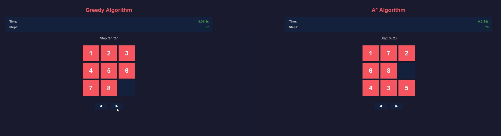

# Game Hub Project
Welcome to the Game Hub a project made for Artificial Intelligence course (CSC361)

## Descreption
simple GUI that allows you to play with **3** Different games that involved with AI:-
### Sudoku
it is a Sudoku Solver that generate a Sudoku puzzel and try to solve it with 2 algorithms:-

  - **Smart CSP (MRV): We implemented the Minimum Remaining Values heuristic,
    which selects the cell with the fewest legal moves first to prune the search tree
    early**.
  - **Simulated Annealing: A local search probabilistic algorithm using a cooling
    schedule and Metropolis acceptance criterion to escape local optima**

### Connect-4 

this is the classic connect-4 game with a 6*7 board that allows you to play against 2 AI agents or watch them play against each other:-

- **MiniMax with Alpha-Beta Pruning**
- **Adaptive MiniMax**

for more details about connect for read `Connect4_game/src/README.md` 

### 8-puzzle

The Solver Will Provide Two Solution With Statistic And Paths A*,Greedy And User Can See Two Algorithm in One GUI And Can Compare Between Them:

- **A\***
- **Greedy**

Here the work done:
https://github.com/majedco03/CSC361_Project
